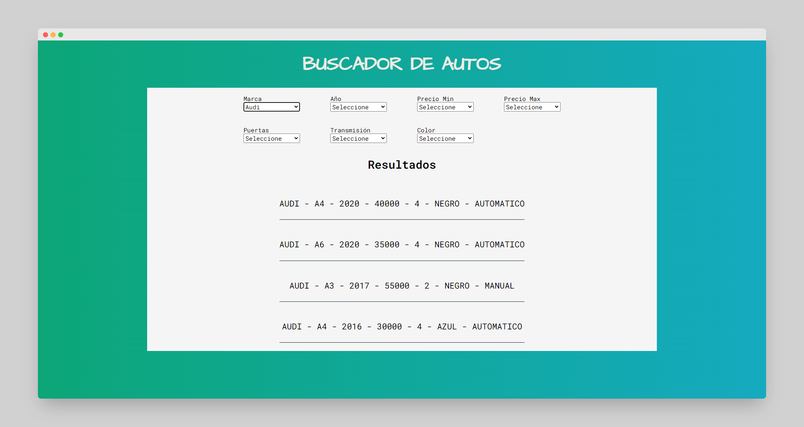
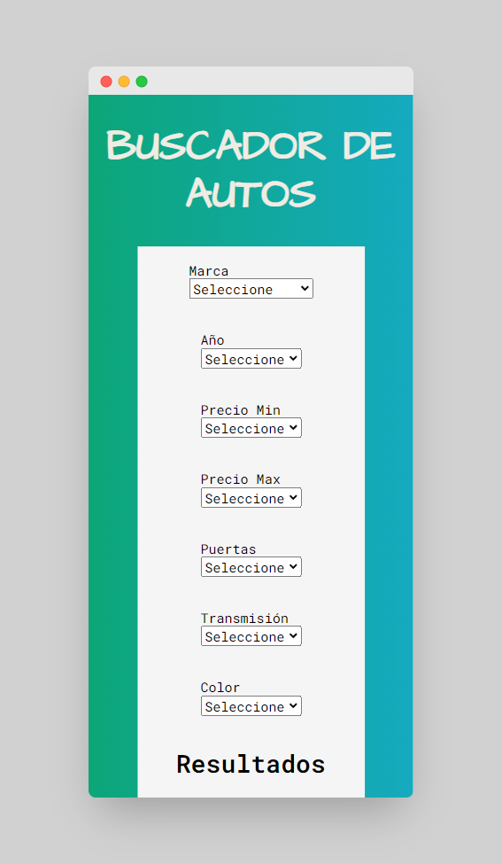

# Buscador de Autos 01
## Table of contents

- [Overview](#overview)
  - [The challenge](#the-challenge)
  - [Screenshot](#screenshot)
  - [Links](#links)
- [My process](#my-process)
  - [Built with](#built-with)
- [Author](#author)

## Overview
### The challenge
In this proyect, the user shuld be able to add filters in options palette and get the results below. In this proyect i focused to practice the filter method, functions and events.

### Screenshot

### Links

- Live Site URL: [Live Site](https://gonzalo-gauna-buscador-de-autos-01.netlify.app/)

## My process

### Built with

- Semantic HTML5 markup
- Flexbox
- Grid
- Javascript

## Author

- Twitter - [@gonzalogaunaDev](https://twitter.com/gonzalogaunaDev)